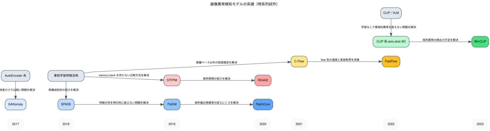

# Anomaly Detection Knowledge

このメモは、画像異常検知モデルがどう発展してきたかと、このリポジトリでの実験を通して何が分かったかを整理したものです。  
対象は主に `PaDiM`, `PatchCore`, `FastFlow`, `STFPM`, `WinCLIP` 系です。

## 全体像

画像異常検知の主要な流れは、大きく次の 4 本です。

- `reconstruction 系`
  - AutoEncoder, GANomaly など
  - 正常画像を再構成し、再構成誤差で異常を測る
- `embedding / memory bank 系`
  - SPADE, PaDiM, PatchCore など
  - 正常特徴の分布や記憶との距離で異常を測る
- `student-teacher / feature matching 系`
  - STFPM, RD4AD など
  - 正常時の特徴再現性の崩れで異常を測る
- `flow / zero-shot / VLM 系`
  - FastFlow, C-Flow, WinCLIP など
  - likelihood 学習や vision-language 表現を使って異常を測る

## 系譜図

Graphviz 版の図です。横軸は発表年のおおまかな時系列で、edge には「どの課題を解決したか」を短く書いています。

## 1. 初期の reconstruction 系

### AutoEncoder 系

- 位置づけ:
  - 初期の異常検知の基本形
- 何をしたか:
  - 正常画像だけで再構成器を学習し、再構成誤差を異常スコアに使った
- 限界:
  - 強い再構成器だと異常もそれなりに再構成できてしまう
  - 高周波の局所異常に弱いことが多い

### GANomaly

- 派生元:
  - AutoEncoder + GAN 系
- 何が改善されたか:
  - 再構成だけでなく潜在空間のずれも異常判定に使うようにした
- 意味:
  - reconstruction 系の代表例だが、近年の industrial AD では主流からは外れた

## 2. Embedding / Memory Bank 系

### SPADE

- 派生元:
  - 事前学習 backbone 特徴を使う流れ
- 何が改善されたか:
  - 再構成ではなく特徴空間の距離を見る方向を強めた
- 意味:
  - 後の PaDiM / PatchCore につながる土台

### PaDiM

- 派生元:
  - SPADE 系の特徴分布ベース
- 何が改善されたか:
  - 正常特徴を location-wise Gaussian として持ち、Mahalanobis 距離で異常を測る
  - industrial AD のベースラインとして強く、実装も比較的明快
- 実務での意味:
  - 学習が軽く、少量正常データでも試しやすい
  - 速度も出しやすく、最初の候補に置きやすい

### PatchCore

- 派生元:
  - PaDiM / nearest-neighbor 系の発展
- 何が改善されたか:
  - 正常 patch embedding を memory bank として保持し、最近傍距離で異常を測る
  - 強い精度を出しやすい
- 実務での意味:
  - 精度重視の候補として有力
  - 一方で memory bank と近傍探索が重く、推論最適化の重要性が高い

## 3. Student-Teacher / Feature Matching 系

### STFPM

- 派生元:
  - 知識蒸留 / feature matching の流れ
- 何が改善されたか:
  - teacher の正常特徴を student が再現できない領域を異常として捉える
- 意味:
  - reconstruction より特徴表現に寄せつつ、memory bank を持たない系として整理できる

### RD4AD

- 派生元:
  - STFPM 系
- 何が改善されたか:
  - 再構成と feature distillation を組み合わせて局所異常への強さを狙った
- 意味:
  - student-teacher 系の発展例

## 4. Flow / Zero-shot / VLM 系

### FastFlow

- 派生元:
  - normalizing flow を industrial AD に寄せた流れ
- 何が改善されたか:
  - 正常特徴の likelihood を直接学び、異常度へ変換する
  - 近年でも速度・精度のバランスが良い候補
- 実務での意味:
  - 学習あり異常検知で、推論最適化の恩恵が大きい

### C-Flow

- 派生元:
  - flow-based AD
- 何が改善されたか:
  - patch / conditional な flow 設計で局所異常を捉えやすくした
- 意味:
  - FastFlow と同系統の発展例

### CLIP 系 zero-shot AD

- 派生元:
  - vision-language model
- 何が改善されたか:
  - 正常・異常の概念を prompt として扱い、学習なし / 少量適応で異常検知に使う流れを作った
- 意味:
  - 正常データが十分に集まらない現場で試しやすい

### WinCLIP

- 派生元:
  - CLIP 系 zero-shot AD
- 何が改善されたか:
  - window / patch 単位の類似度を活用して、zero-shot でも局所異常を見やすくした
- 実務での意味:
  - 学習なしで試せる点が強い
  - ただし supervised 系より精度が低いケースは普通にある

## このリポジトリで分かったこと

対象:

- `PaDiM`
- `PatchCore`
- `FastFlow`
- `WinCLIP zero-shot`

データ:

- `VisA`
- 本番評価は `candle` 単体

### 1. 精度だけを見ると PatchCore が最有力

本番評価では、学習ありモデルの中で `PatchCore` が最も高い image-level / pixel-level 指標を出した。

実装上の意味:

- 精度を最優先するなら、まず `PatchCore` を候補に置く価値が高い
- ただし近傍探索が重く、推論速度は他モデルより不利になりやすい

### 2. 速度最適化込みで見ると FastFlow と PaDiM がかなり実務的

今回の推論最適化実験では、`PaDiM` と `FastFlow` は `TensorRT FP16` や `torch.compile + AMP` によって 1 枚あたり推論時間を大きく下げられた。

観察できたこと:

- `PaDiM`
  - もともと学習が軽い
  - `TensorRT FP16` でかなり低レイテンシ化できた
  - 精度は baseline とほぼ同等
- `FastFlow`
  - baseline でも十分速い
  - `TensorRT FP16` や compile 系でさらに短縮できた
  - image-level F1 の変動は小さい

実務での意味:

- `PaDiM`
  - 初期導入・高速 PoC・CPU/GPU 混在検証に向く
- `FastFlow`
  - 「十分な精度」と「速さ」のバランス候補としてかなり強い

### 3. WinCLIP zero-shot は「学習不要」が強みで、精度は supervised 系より控えめ

`WinCLIP zero-shot` は、学習ありモデルより absolute F1 が低かった。  
一方で、学習なしで動かせること自体が大きい。

実務での意味:

- 正常データが揃っていない
- まず動くものを早く見たい
- 教師なし / zero-shot 比較をしたい

こうした状況では価値がある。  
ただし、最終的な本番候補としては supervised 系に負けることがある。

### 4. ONNX / TensorRT は全モデルで「素直に同じように効く」わけではない

今回の実験では、`ONNX Runtime + TensorRT` はモデルによって挙動差が大きかった。

特に注意点:

- `PatchCore`
  - `TensorRT FP16` は通ったが、`TensorRT FP32` は enqueue failure が出た
  - `ONNX Runtime CUDA FP32` は極端に遅く、単純 export では有利にならなかった
- `PaDiM`, `FastFlow`, `WinCLIP`
  - TensorRT の恩恵が比較的出やすかった

実務での意味:

- `ONNX / TensorRT` は「入れれば速い」ではなく、**モデルごとに実測が必要**
- 特に `PatchCore` のような memory bank / 近傍探索系は、export 後の実行が素直に速くならないことがある

### 5. `torch.compile` は有効な場合もあるが、万能ではない

実験では `torch.compile` で速くなるケースもあったが、常に最良ではなかった。

観察:

- `PatchCore` では `torch_compile_amp_fp16` が baseline よりかなり速かった
- `FastFlow` では compile 系も有効だったが、TensorRT FP16 の方がさらに低レイテンシ
- `WinCLIP` では compile の効果が限定的で、ONNX / TensorRT の方が効いた

実務での意味:

- `torch.compile` は導入コストが比較的低い first try として有効
- ただし、最終的には `AMP`, `ONNX Runtime`, `TensorRT` と並べて比較すべき

## 実務上の選び方

ざっくり整理すると、今回の結果からの第一候補は次のようになる。

### 精度最優先

- `PatchCore`

向いている状況:

- 誤検知 / 見逃しを強く抑えたい
- 推論速度より精度を優先する

### 速度と精度のバランス

- `FastFlow`

向いている状況:

- GPU 推論で低レイテンシ化したい
- supervised 系で十分な精度も欲しい

### 軽量導入・初期ベースライン

- `PaDiM`

向いている状況:

- 学習コストを抑えたい
- まず industrial AD の標準ベースラインを置きたい
- TensorRT 最適化まで含めて素直に運用したい

### 学習なしで試す

- `WinCLIP zero-shot`

向いている状況:

- 正常データが少ない
- prompt ベースで早く比較したい
- supervised 学習前の探索段階

## ここでの結論

今回の実装・評価・推論最適化まで通して整理すると、次が実務的な結論になる。

- `PatchCore`
  - 精度最有力
  - ただし推論最適化の難易度は高め
- `FastFlow`
  - 精度と速度のバランスが良い
  - 本番候補としてかなり扱いやすい
- `PaDiM`
  - 学習・運用・最適化の全体コストが低く、強いベースライン
- `WinCLIP zero-shot`
  - 学習不要という独自の価値がある
  - ただし最終精度は supervised 系と別枠で見るべき

つまり:

- **最終精度を狙うなら `PatchCore`**
- **実務バランスなら `FastFlow`**
- **まず始めるなら `PaDiM`**
- **学習なし探索なら `WinCLIP zero-shot`**
