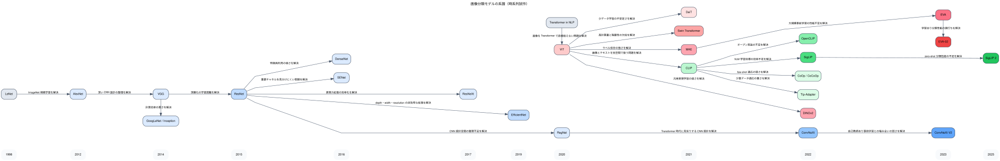

# Classification Knowledge

このメモは、画像分類モデルが歴史的にどう発展してきたかを、**派生関係** と **何が改善されたか** の観点で整理したものです。  
実装観点で重要な流れに絞って、CNN 系と Transformer / VLM 系をまとめます。

## 全体像

大きく分けると、画像分類モデルの発展は次の 3 本です。

- `CNN 系`
  - AlexNet から始まり、ResNet, EfficientNet, ConvNeXt 系へつながる
- `Vision Transformer 系`
  - ViT から始まり、DeiT, Swin, EVA, DINOv2 系へつながる
- `Vision-Language 系`
  - CLIP から始まり、OpenCLIP, SigLIP, few-shot 系へつながる

## 系譜図

Graphviz 版の図です。横軸は発表年のおおまかな時系列で、edge には「どの課題を解決したか」を短く書いています。

## 1. CNN 系の流れ

### LeNet

- 位置づけ:
  - 初期の CNN の代表
- 何をしたか:
  - 画像に対して畳み込みを使う基本形を作った
- 限界:
  - 小規模データ・小規模モデル前提

### AlexNet

- 派生元:
  - 初期 CNN の延長
- 何ができるようになったか:
  - ImageNet 規模で CNN が実用になることを示した
  - `ReLU`, `Dropout`, GPU 学習の実用化
- 重要性:
  - 画像分類ブームの起点

### VGG

- 派生元:
  - AlexNet 系の CNN
- 何が改善されたか:
  - 小さい `3x3 conv` を深く積む設計を整理した
  - 構造が非常に分かりやすくなった
- 限界:
  - パラメータ数が多く重い

### GoogLeNet / Inception

- 派生元:
  - VGG 時代の深い CNN の流れ
- 何が改善されたか:
  - 計算量を抑えつつ多スケール特徴を扱いやすくした
  - 「同じ深さでももっと効率良く」という方向

### ResNet

- 派生元:
  - VGG / Inception 系の「深くすると学習しづらい」問題意識
- 何が改善されたか:
  - `skip connection / residual connection` で非常に深いネットを学習しやすくした
  - 勾配消失や最適化の難しさをかなり緩和
- 重要性:
  - その後の CNN 系の基礎部品になった

### ResNeXt

- 派生元:
  - ResNet
- 何が改善されたか:
  - depth / width に加えて `cardinality` という軸を入れた
  - より効率よく表現力を増やせるようにした

### DenseNet

- 派生元:
  - ResNet の skip connection 系の発想
- 何が改善されたか:
  - 層間をより密につなぎ、特徴再利用を強めた
- 得意な点:
  - パラメータ効率が良い

### SENet

- 派生元:
  - ResNet 系 backbone
- 何が改善されたか:
  - channel attention を入れて、重要チャネルを強調できるようにした
- 意味:
  - attention を CNN に入れる流れの代表

### EfficientNet

- 派生元:
  - MobileNet / CNN 効率化の流れ
- 何が改善されたか:
  - depth, width, resolution をバランスよく同時に scaling
  - 少ない計算量で高精度
- 重要性:
  - 実務で「軽くて強い CNN」の代表になった

### RegNet

- 派生元:
  - ResNet 系の設計探索
- 何が改善されたか:
  - CNN の設計空間を整理して、スケールしやすい形を作った

### ConvNeXt

- 派生元:
  - ResNet / RegNet 系 CNN
- 何が改善されたか:
  - Transformer 時代の知見を CNN 側へ逆輸入した
  - patch-like stem, large kernel, normalization 設計の見直し
- 重要性:
  - 「CNN でもまだかなり戦える」を示した

### ConvNeXt V2

- 派生元:
  - ConvNeXt
- 何が改善されたか:
  - `MAE` 的事前学習との相性を見直した
  - `GRN (Global Response Normalization)` を導入
- 意味:
  - CNN 系の frontier 候補

## 2. Transformer 系の流れ

### ViT

- 派生元:
  - NLP の Transformer
- 何が改善されたか:
  - 画像を patch 列として扱い、CNN なしで分類できるようにした
- 重要性:
  - 画像分類に Transformer 軸を作った
- 限界:
  - データ量が少ないと学習が不安定

### DeiT

- 派生元:
  - ViT
- 何が改善されたか:
  - より少ないデータでも ViT を学習しやすくした
  - distillation を活用
- 意味:
  - ViT を実務寄りにした

### Swin Transformer

- 派生元:
  - ViT
- 何が改善されたか:
  - window ベース attention にして計算量を現実的にした
  - 階層構造を導入して dense prediction にも使いやすくした
- 意味:
  - 検出・セグメンテーションでも強い backbone になった

### MAE

- 派生元:
  - ViT
- 何が改善されたか:
  - masked autoencoding による自己教師あり事前学習
- 意味:
  - ラベルが少なくても強い特徴を作る流れを加速した

### EVA / EVA-02

- 派生元:
  - ViT + MAE 系
- 何が改善されたか:
  - より大規模な事前学習と高性能な ViT を実現
  - 学習あり分類側の frontier 候補
- 実務での意味:
  - `timm` でそのまま強い backbone として使える

### DINO / DINOv2

- 派生元:
  - ViT の自己教師あり学習
- 何が改善されたか:
  - ラベルなしでも強い表現を学べる
  - 特徴抽出器としてかなり強い
- 意味:
  - zero-shot 的な分類や少量ラベル適応で強い基盤

## 3. Vision-Language 系の流れ

### CLIP

- 派生元:
  - ViT / ResNet + contrastive learning
- 何が改善されたか:
  - 画像とテキストを同じ表現空間へ載せた
  - `zero-shot classification` を強く実用化した
- 重要性:
  - 「ラベル名を文章として渡すだけで分類」が現実になった

### OpenCLIP

- 派生元:
  - CLIP
- 何が改善されたか:
  - オープン実装・オープン学習で広く使えるようになった
- 意味:
  - 実装実務の標準入口

### SigLIP / SigLIP 2

- 派生元:
  - CLIP 系 vision-language learning
- 何が改善されたか:
  - 特に zero-shot 分類で強い性能
  - 現在の zero-shot frontier 候補
- どういう目的のモデルか:
  - 画像とテキストを同じ意味空間に載せることが目的
  - 学習時は「対応する画像とテキストは近く、対応しないものは遠く」なるように学習する
- 分類でどう使うか:
  - 学習なし zero-shot では、画像とラベル文の類似度を比較して分類する
  - few-shot では、埋め込みや軽い分類 head を使って少量データ適応に使える
- 実装目線の理解:
  - `CLIP` 系の延長で、画像分類では特に zero-shot が素直にやりやすい

### Florence-2

- 派生元:
  - 汎用 vision-language foundation model の流れ
- 何が改善されたか:
  - 分類だけでなく caption, grounding, OCR などを prompt ベースでまとめて扱える
  - 1 つのモデルで多目的に使いやすい
- どういう目的のモデルか:
  - 画像を見て、与えられた指示に応じてテキストで答えることが目的
  - 学習時は画像とテキストを大量に使い、多様な vision-language タスクをまとめて扱えるようにしている
- 分類でどう使うか:
  - zero-shot 的には、候補ラベルを含む prompt を与えて、その回答をラベルへ対応付ける
  - supervised / few-shot では、backbone の上に分類 head を載せて fine-tuning することもできる
- 実装目線の理解:
  - `SigLIP 2` より分類専用ではないが、prompt ベースで柔軟に試せる

### CoOp / CoCoOp

- 派生元:
  - CLIP
- 何が改善されたか:
  - prompt を学習可能にして few-shot 適応しやすくした
- 意味:
  - few-shot の代表的手法

### Tip-Adapter

- 派生元:
  - CLIP
- 何が改善されたか:
  - 少量データへの適応を軽量にできる
  - training-free 寄りで扱いやすい

## 実務目線での整理

今このリポジトリで重要なのは、全部を同じ深さで追うことではなく、次の位置づけで捉えることです。

### 理論理解用

- AlexNet
- VGG
- ResNet
- ViT
- CLIP

これらは「なぜ次のモデルが出てきたか」を理解するために重要です。

### current / 実務標準寄り

- EfficientNet
- Swin
- OpenCLIP
- DINOv2

これらは、案件や実装記事でもまだよく見ます。

### frontier / 実装主対象

- ConvNeXt V2
- EVA-02
- SigLIP 2
- few-shot 系なら `Tip-Adapter`, `CoCoOp`

この repo では、基本的に **frontier を実装主対象** にする方針です。

## ざっくり一言で言うと

- `AlexNet`
  - 深層 CNN で ImageNet を本気で勝ちに行った起点
- `ResNet`
  - 深くしても学習できるようにした
- `EfficientNet`
  - CNN を効率良く強くした
- `ConvNeXt / ConvNeXt V2`
  - Transformer 時代の知見を取り込んだ CNN の再設計
- `ViT`
  - 画像を patch 列として Transformer で扱う流れを作った
- `Swin`
  - ViT を実務向け backbone に寄せた
- `EVA-02`
  - 学習あり分類側の frontier ViT
- `CLIP`
  - zero-shot 分類を強く実用化した
- `SigLIP 2`
  - zero-shot 分類側の frontier 候補

## 次に見るとよいもの

この知識を踏まえて実装順を考えるなら、分類では次が自然です。

1. `ConvNeXt V2`
2. `EVA-02`
3. `OpenCLIP`
4. `SigLIP 2`
5. `Tip-Adapter` または `CoCoOp`

この順なら、

- supervised CNN
- supervised Transformer
- zero-shot
- few-shot

の流れがきれいにつながります。

## 今回の実験で分かったこと

`Oxford-IIIT Pet` を使った今回の実験から、モデルごとの立ち位置がかなりはっきりした。

### supervised の強さ

- `EVA-02`
  - supervised では今回の最良
  - `test_accuracy=0.9419`
- `ConvNeXt V2`
  - 非常に強い baseline
  - `test_accuracy=0.9264`
- `SigLIP2`
  - supervised でも十分強い
  - `test_accuracy=0.9150`
- `Florence-2`
  - 今回の画像分類設定ではかなり弱い
  - `test_accuracy=0.0690`

実務的な理解:
- 学習あり分類の本命は、今のところ `EVA-02` と `ConvNeXt V2`
- `SigLIP2` は supervised でも使えるが、本領は zero-shot / few-shot 側
- `Florence-2` は画像分類の主力に据えるべきではない

### zero-shot / few-shot の強さ

- `SigLIP2 zero-shot`
  - `test_accuracy=0.7144`
  - 学習なしとしてはかなり有望
- `SigLIP2 few-shot`
  - `test_accuracy=0.7386`
  - zero-shot より改善
- `Florence-2 zero-shot`
  - `test_accuracy=0.2567`
- `Florence-2 few-shot`
  - `test_accuracy=0.0264`

実務的な理解:
- アノテーション不足前提では、今回一番価値があったのは `SigLIP2`
- `SigLIP2` は「まず zero-shot で当たりを見る -> few-shot で少し伸ばす」という使い方がかなり自然
- `Florence-2` は分類より、別タスクで使う方がよさそう

### tuning の効き方

- `ConvNeXt V2`
  - tuning で素直に伸びる
  - `image_size=256`, `batch_size=64` が効いた
- `EVA-02`
  - かなり低い learning rate が効いた
  - `batch_size=64` まで上げたときに良化
- `SigLIP2`
  - 低い learning rate と小さい weight decay が効いた
  - batch size を上げる価値があった
- `Florence-2`
  - tuning を入れても改善幅は小さかった

### モデル選定の現時点の結論

- supervised 本命:
  - `EVA-02`
  - `ConvNeXt V2`
- アノテーション不足前提の本命:
  - `SigLIP2 zero-shot`
  - `SigLIP2 few-shot`
- 優先度を下げてよい:
  - `Florence-2` を画像分類の中心に据える方針

## 未検証項目

- 学習データのサンプルサイズと各モデルの精度の関係
  - supervised でどのモデルが少量データに強いか
  - few-shot の `shots_per_class` を増やしたときの伸び方
  - zero-shot と few-shot の境界がどこにあるか
- `SigLIP2` の prompt 改善による zero-shot 精度向上
- `SigLIP2` few-shot の head 設計改善
- retrieval 的な補助を入れた場合の改善幅
- `EVA-02` と `ConvNeXt V2` のクラス別強弱の違い
