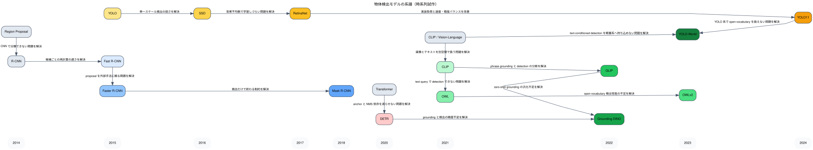

# Object Detection Knowledge

このメモは、物体検出モデルがどう発展してきたかと、このリポジトリでの実験を通して何が分かったかを整理したものです。  
対象は主に `YOLO11`, `Grounding DINO`, `YOLO-World`, `OWLv2` です。

## 全体像

物体検出モデルの主要な流れは、大きく次の 3 本です。

- `two-stage / proposal 系`
  - R-CNN, Fast R-CNN, Faster R-CNN, Mask R-CNN など
  - 候補領域を出してから分類・位置合わせする
- `one-stage / dense prediction 系`
  - SSD, RetinaNet, YOLO 系, DETR 派生など
  - 画像全体から直接 box と class を出す
- `open-vocabulary / zero-shot 系`
  - GLIP, Grounding DINO, YOLO-World, OWL / OWLv2 など
  - クラス名や自然言語 query を使って、学習時に明示的に持っていないカテゴリも扱う

## 系譜図

Graphviz 版の図です。横軸は発表年のおおまかな時系列で、edge には「どの課題を解決したか」を短く書いています。

## 1. Two-stage / Proposal 系

### R-CNN

- 位置づけ:
  - 深層学習ベース物体検出の初期代表
- 何をしたか:
  - selective search などで候補領域を出し、各領域を CNN + classifier で判定した
- 限界:
  - 候補ごとに推論するため遅い

### Fast R-CNN

- 派生元:
  - R-CNN
- 何が改善されたか:
  - 画像全体の特徴を一度計算し、RoI pooling で候補領域を切り出す形にした
- 意味:
  - 領域ごとの再計算を減らして高速化した

### Faster R-CNN

- 派生元:
  - Fast R-CNN
- 何が改善されたか:
  - 候補領域生成もネットワーク内の RPN で学習するようにした
- 重要性:
  - proposal 系を実務レベルに押し上げた代表

### Mask R-CNN

- 派生元:
  - Faster R-CNN
- 何が改善されたか:
  - detection に instance segmentation を追加した
- 意味:
  - dense prediction 系タスクへ広がる土台

## 2. One-stage / Dense Prediction 系

### SSD

- 派生元:
  - proposal を使わずに直接検出する流れ
- 何が改善されたか:
  - 複数スケール feature map から box を直接回帰した
- 意味:
  - one-stage detector の初期代表

### RetinaNet

- 派生元:
  - SSD 系 one-stage detector
- 何が改善されたか:
  - `focal loss` により、背景が多すぎる class imbalance を緩和した
- 重要性:
  - one-stage でも精度を出しやすくした

### YOLO 系

- 派生元:
  - one-stage detector 全般
- 何が改善されたか:
  - 速度と実装簡潔さを強く重視しつつ精度も改善してきた
- 実務での意味:
  - 学習・推論・export まで含めて扱いやすく、現場導入しやすい

### DETR 系

- 派生元:
  - transformer を detection に持ち込む流れ
- 何が改善されたか:
  - NMS や anchor 設計への依存を減らし、set prediction として detection を解くようにした
- 限界:
  - 初期 DETR は収束が遅い

## 3. Open-vocabulary / Zero-shot 系

### OWL / OWLv2

- 派生元:
  - CLIP 系の image-text 表現
- 何が改善されたか:
  - 画像とテキスト query の類似度を使って detection を解けるようにした
- 実務での意味:
  - 学習なしで「候補カテゴリを文章で与える」使い方がしやすい

### Grounding DINO

- 派生元:
  - DETR 系 + grounding / phrase grounding の流れ
- 何が改善されたか:
  - 自然言語 query に対して box を返す open-set / grounding 寄り detection を高精度化した
- 実務での意味:
  - zero-shot でかなり高い検出力があり、まず試す候補に置きやすい

### YOLO-World

- 派生元:
  - YOLO 系 + open-vocabulary 化
- 何が改善されたか:
  - YOLO の高速系アーキテクチャに text query 条件づけを持ち込んだ
- 実務での意味:
  - zero-shot を速度重視で使いたいときの候補

## このリポジトリで分かったこと

対象:

- `YOLO11` (supervised)
- `Grounding DINO` (zero-shot)
- `YOLO-World` (zero-shot)
- `OWLv2` (zero-shot)

データ:

- `COCO 2017`
- full val2017 評価

評価指標:

- `mAP@[0.5:0.95]`
- `AP@0.5`
- `AP@0.75`
- `small / medium / large` 別 mAP

### 1. 現時点の full val では Grounding DINO が zero-shot 第一候補

full val の結果は次のとおりだった。

- `Grounding DINO`
  - `mAP = 0.500`
  - `AP@0.5 = 0.651`
- `OWLv2`
  - `mAP = 0.449`
  - `AP@0.5 = 0.649`
- `YOLO-World`
  - `mAP = 0.368`
  - `AP@0.5 = 0.518`

この結果から、zero-shot の中では `Grounding DINO` が最も安定して高い。  
`AP@0.5` だけ見ると `Grounding DINO` と `OWLv2` はかなり近いが、より厳しい COCO 主指標 `mAP@[0.5:0.95]` では `Grounding DINO` が明確に上だった。

ここから読み取れること:

- `Grounding DINO`
  - 「何かをだいたい当てる力」だけでなく、「box をある程度きちんと詰める力」も比較的強い
- `OWLv2`
  - 粗い IoU 条件ではかなり健闘するが、厳しめの IoU を平均すると一段落ちる
- `YOLO-World`
  - open-vocabulary を速度寄りで扱うには魅力があるが、この条件では absolute 精度が足りない

実務上の意味:

- zero-shot を主候補に置くなら、まず `Grounding DINO` をベースラインにするのが自然
- `OWLv2` は prompt や threshold を詰める価値がある second candidate
- `YOLO-World` は速度やデプロイ都合で選ぶ余地はあるが、精度だけを見ると優先度は下がる

### 2. zero-shot でも `AP@0.5` と `mAP@[0.5:0.95]` はかなり別物として見た方がよい

今回の結果では、`Grounding DINO` の `AP@0.5 = 0.651` に対して `mAP = 0.500`、`OWLv2` は `AP@0.5 = 0.649` に対して `mAP = 0.449` だった。

この差が意味すること:

- `AP@0.5`
  - box が「だいたい合っている」かを見る、比較的ゆるい指標
- `mAP@[0.5:0.95]`
  - `0.50, 0.55, ..., 0.95` の IoU を全部平均するので、位置合わせの甘さがより強く効く

見た目ではうまくいっているように見えても、box の端が甘い、サイズが少し大きい、小物体でズレる、という要因で `mAP` は落ちる。  
そのため、実務で「画像上でそれっぽく見えるのに指標が低い」と感じたら、まず `AP@0.5` と `AP@0.75` の差を見るべきだと分かった。

実務上の意味:

- downstream が「だいたい見つかればよい」なら `AP@0.5` を重く見てよい
- OCR 切り出しや細かい位置合わせが必要なら `mAP@[0.5:0.95]` や `AP@0.75` を重く見るべき

### 3. 小物体は zero-shot / supervised を問わず難しく、全体 mAP を押し下げる

今回の full val 結果では、`map_small` が全モデルで低かった。

- `Grounding DINO`: `0.315`
- `OWLv2`: `0.310`
- `YOLO-World`: `0.205`
- `YOLO11`: `0.166`

一方で `map_large` はかなり高い。

- `Grounding DINO`: `0.676`
- `OWLv2`: `0.608`
- `YOLO-World`: `0.487`
- `YOLO11`: `0.442`

ここから分かったこと:

- 今回の差は「モデルの絶対性能差」だけではなく、「小物体への強さ」でかなり説明できる
- zero-shot 系は small object で苦しいが、`Grounding DINO` と `OWLv2` は supervised の `YOLO11` より良い値を出している

これは直感に反するように見えるが、今回の `YOLO11` は短めの grid 学習であり、COCO full 学習を十分に詰めた条件ではない。  
つまり、この比較は「zero-shot が常に supervised より強い」という意味ではなく、**現時点の repo 実装と実験条件では zero-shot の方が良かった** と読むべきだと分かった。

実務上の意味:

- 小物体が重要な案件では、入力解像度や multi-scale 推論を優先的に検討すべき
- zero-shot だから弱い、supervised だから強い、とは単純に言えず、学習条件をきちんと揃える必要がある

### 4. supervised の YOLO11 は「実装が壊れていた」のではなく、データセット構成の落とし穴で一度失敗した

今回、`YOLO11` では一度 `mAP = 0` が出た。  
原因を調べると、`data/coco/images/train2017 -> train2017` の symlink 構成が Ultralytics の path 解決と噛み合っておらず、label 解決が壊れていた。

対応したこと:

- `setup_coco_yolo.py` を、`images/` を symlink で作る方式から、hardlink を使った実体ディレクトリ方式へ修正した
- stale cache を削除して再スキャンさせた

この修正後は `YOLO11` の full val が

- `mAP = 0.320`
- `AP@0.5 = 0.470`

まで回復した。

ここで重要なのは、今回の失敗は「YOLO11 が弱い」以前に、**データセットセットアップが detector 実装と整合していなかった** ことだという点である。

実務上の意味:

- detector では model 本体だけでなく、dataset path 解決や cache の挙動も精度に直結する
- mAP が極端に 0 に近いときは、まず学習ロジックより dataset 構成を疑うべき

### 5. supervised を少し回しただけでは、zero-shot に簡単には勝てない

今回の結果では `YOLO11` の full val は

- `mAP = 0.320`
- `AP@0.5 = 0.470`

で、zero-shot 3モデルより下だった。

この結果だけを見ると「zero-shot の方が強い」と言いたくなるが、丁寧に読むとそうではない。

今回の `YOLO11` は:

- `yolo11n / yolo11s`
- `img_size = 640`
- `epochs = 10`
- `patience = 3`
- 小さめの grid

というかなり軽めの条件である。  
つまり、これは supervised を十分詰めた結果ではなく、**まず壊れずに回る条件へ寄せた初期実験** である。

この実験から分かることは次の 2 点。

- zero-shot は、学習を積まなくてもすぐに高い初期性能を出せる
- supervised は、本気で比較するには学習条件と探索をもっと丁寧に詰める必要がある

実務上の意味:

- PoC 初期やラベル未整備段階では zero-shot の投資対効果が非常に高い
- ただし、本番要件で精度を詰める段階では supervised を捨ててよい、という結論にはならない

### 6. category ごとの強弱を見ると、モデルごとに失敗パターンがかなり違う

`per_category_ap.csv` を見ると、上位カテゴリは似ていても、苦手カテゴリには差があった。

観察できたこと:

- `Grounding DINO`
  - `bear`, `frisbee`, `cat`, `giraffe`, `fire hydrant` などは高い
  - `book`, `backpack`, `handbag` などは弱め
- `OWLv2`
  - `cat`, `frisbee`, `fire hydrant`, `bear`, `airplane` などが強い
  - `apple`, `hair drier`, `parking meter` などが弱め
- `YOLO-World`
  - `giraffe`, `zebra`, `airplane`, `train` は強い
  - `remote`, `knife`, `spoon`, `book`, `hair drier` がかなり弱い
- `YOLO11`
  - `zebra`, `giraffe`, `elephant`, `cat`, `person` は比較的出ている
  - `hair drier`, `backpack`, `spoon`, `knife`, `handbag` は弱い

この結果から、単に平均 mAP だけでモデルを選ぶと危険だと分かった。  
案件で重要なのが `person`, `car`, `helmet`, `box`, `defect part` のような特定クラスであるなら、**そのクラスに近いカテゴリでどう出るか** を見る方が重要である。

実務上の意味:

- 平均 mAP より per-category AP を優先して選ぶ場面が多い
- zero-shot モデル選定は「業務クラスに近いカテゴリでどれが強いか」で決めるべき

## 実務上の選び方

ざっくり整理すると、今回の結果からの第一候補は次のようになる。

### zero-shot でまず試す

- `Grounding DINO`

向いている状況:

- ラベルがまだない
- まず PoC を早く回したい
- open-vocabulary で対象カテゴリをあとから変えたい

### zero-shot の第二候補

- `OWLv2`

向いている状況:

- text query ベースで素直に試したい
- `Grounding DINO` と比較して prompt / threshold 差を見たい

### 速度や YOLO 系デプロイ都合を優先

- `YOLO-World`

向いている状況:

- ultralytics 系の扱いやすさを活かしたい
- absolute 精度より運用容易性を優先する

### supervised を育てる前提の候補

- `YOLO11`

向いている状況:

- ラベルデータを用意できる
- 将来的に fine-tuning / export / deployment まで含めて運用したい

## 次にやるとよいこと

- `Grounding DINO`
  - prompt 改善
  - class chunk 戦略の見直し
  - threshold 最適化
- `OWLv2`
  - query template 改善
  - score threshold と TTA の比較
- `YOLO-World`
  - conf / NMS の再調整
  - 高解像度化
- `YOLO11`
  - より本番寄りの学習条件へ拡張
  - img_size / epoch / model size の再探索
  - small object を意識した設定見直し
