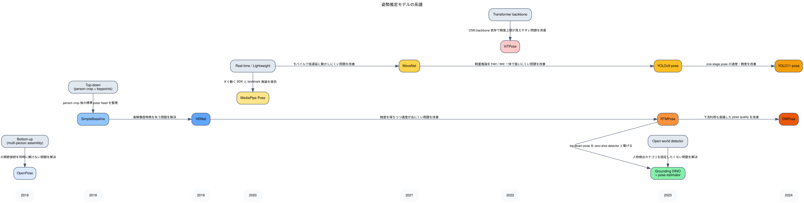

# Pose Estimation Knowledge

このメモは、姿勢推定モデルがどう発展してきたかと、このリポジトリでの実験を通して何が分かったかを整理したものです。  
対象は主に `YOLO11-pose`, `RTMPose`, `MoveNet`, `MediaPipe Pose`, `ViTPose` です。

## 全体像

姿勢推定モデルの主要な流れは、大きく次の 4 本です。

- `bottom-up 系`
  - OpenPose など
  - 画像全体から複数人物の keypoint と関係を同時に組み立てる
- `top-down heatmap 系`
  - SimpleBaseline, HRNet など
  - 先に person bbox を用意し、その中で関節 heatmap を推定する
- `lightweight / real-time 系`
  - MoveNet, MediaPipe Pose, YOLO pose 系, RTMPose など
  - 速度・実装容易性・デプロイ性を重視する
- `Transformer / composite 系`
  - ViTPose, Grounding DINO + pose estimator など
  - 強い backbone や open-world detector と組み合わせて精度や汎用性を上げる

## 系譜図

Graphviz 版の図です。横軸は発表年のおおまかな時系列で、edge には「どの課題を解決したか」を短く書いています。

## 1. Bottom-up 系

### OpenPose

- 位置づけ:
  - multi-person pose 推定の古典
- 何をしたか:
  - part confidence map と `PAF (Part Affinity Field)` で、人物ごとの関節接続を解いた
- 意味:
  - detector を前段に持たなくても複数人物を扱える流れを作った
- 限界:
  - 密集シーンでは依然難しい
  - 現在の実務本命というより、発想の起点として重要

## 2. Top-down Heatmap 系

### SimpleBaseline

- 派生元:
  - top-down pose の標準形
- 何が改善されたか:
  - detector + heatmap head の素直な構成で、強い基準線を作った
- 意味:
  - 「person crop してから keypoint を打つ」流れを分かりやすく定着させた

### HRNet

- 派生元:
  - SimpleBaseline 系の heatmap 回帰
- 何が改善されたか:
  - 高解像度特徴を最後まで保持しながら多解像度特徴を融合した
- 意味:
  - 関節位置の精密さが重要な pose で非常に強い backbone になった
- 実務での意味:
  - pretrained 推論でも強いが、近年はより軽量な RTMPose 系に置き換わる場面が増えた

## 3. Lightweight / Real-time 系

### MediaPipe Pose

- 派生元:
  - 軽量 landmark 推定 + 実用 SDK の流れ
- 何が改善されたか:
  - Python / mobile / web からそのまま使いやすい実装と、33 点 landmark を提供した
- 意味:
  - 「学習しなくてもすぐ動く姿勢推定」の代表
- 実務での意味:
  - デモ、リアルタイムアプリ、PoC に非常に向く

### MoveNet

- 派生元:
  - Google 系 lightweight pose
- 何が改善されたか:
  - 17 点 human pose を非常に軽量・高速に推論できるようにした
- 意味:
  - モバイルや webcam のような低遅延用途の主力候補
- 実務での意味:
  - 「まず速く動かしたい」ケースでは今でも有力

### YOLO Pose 系

#### YOLOv8-pose

- 派生元:
  - YOLO 系 one-stage detector
- 何が改善されたか:
  - detection と pose を一体で扱いやすくし、Ultralytics エコシステムで導入しやすくした
- 意味:
  - pose 推定の実装入口として非常に強い

#### YOLO11-pose

- 派生元:
  - YOLOv8-pose
- 何が改善されたか:
  - one-stage pose の速度・精度・扱いやすさをさらに改善した
- 意味:
  - 学習あり実験の主線にも、pretrained 推論の入口にも置きやすい
- 実務での意味:
  - Python から train / test / inference をまとめて回したいときに非常に強い

### RTMPose

- 派生元:
  - top-down heatmap 系 + 実務向け軽量化の流れ
- 何が改善されたか:
  - top-down pose の精度を保ちつつ、推論速度もかなり改善した
- 意味:
  - `MMPose` 系の現実務本命になりやすい
- 実務での意味:
  - detector + pose の標準的な 2 段構成を組むときの第一候補

## 4. Transformer / Composite 系

### ViTPose

- 派生元:
  - ViT backbone を pose に使う流れ
- 何が改善されたか:
  - CNN ではなく Transformer 特徴抽出で高精度 pose を実現した
- 意味:
  - pose における Transformer 系の代表

### DWPose

- 派生元:
  - RTMPose / distillation 系の流れ
- 何が改善されたか:
  - 下流タスク利用や可視化用途も意識した pose quality を狙った
- 意味:
  - OpenPose editor 系でも採用例がある modern pose 候補

### Grounding DINO + pose estimator

- 派生元:
  - open-world detector + top-down pose の 2 段構成
- 何が改善されたか:
  - `person` のような text prompt から人物候補を zero-shot で拾い、後段 pose に流せる
- 意味:
  - detector 側に学習済みカテゴリ制約を持ち込みたくないときの有力構成
- 実務での意味:
  - 少量データ立ち上げや open-world 寄り要件で有用

## MMPose について

`MMPose` は単一モデルではなく、`RTMPose`, `ViTPose`, `HRNet`, `COCO-WholeBody` 系を含む pose ライブラリ / toolbox として理解するのが自然である。

実務上の意味:

- pretrained 推論をまとめて試しやすい
- top-down / bottom-up / whole-body 系を同一エコシステムで扱える
- 一方で OpenMMLab 依存のセットアップは Ultralytics より重いことがある

## このリポジトリで分かったこと

現時点の対象:

- `YOLO11-pose`
- `COCO person keypoints`（human 17 keypoints）

現時点で分かっていること:

### 1. 今の実装と評価は human pose のみを対象にしている

現在の dataset と config は `COCO person keypoints` 前提であり、対象クラスは `person` のみである。  
そのため、animal pose や hand / face / whole-body は今は含まれていない。

実装上の意味:

- 今の学習・評価は人以外の pose を見ていない
- 別タスクをやるには別 dataset と別 keypoint 定義が必要

### 2. YOLO11-pose は pretrained 推論でも入口として十分使える

今回の整理で明確になったのは、`YOLO11-pose` は「学習して比較する対象」であると同時に、「学習なしでまず動かす対象」でもあることだった。

実務上の意味:

- まず pretrained で動作確認する
- 必要なら fine-tune して比較実験に進む

この順番が自然である。

### 3. partial body / truncation / crowd は明確な難所

notebook で qualitative に見た限り、次の条件で予測が崩れやすい。

- 手だけ、上半身だけなど部分しか見えていない
- 全身がフレーム内に入っていない
- 人が多く重なっている
- 小さく写っている
- 遮蔽が強い

これは pose 推定で典型的に難しい条件であり、今回の失敗傾向もその教科書通りだった。

実務上の意味:

- 単純な AP だけでなく、失敗パターンを `partial body / truncation / crowd / small person / occlusion` に分けて見る価値がある
- detector + pose の 2 段構成にするか、one-stage のまま行くかは、こうした難例で差が出やすい

### 4. 可視化では「何を描いているか」を明示しないと誤解しやすい

今回の notebook では、最初に「GT と prediction の 1 人だけを描く版」を作ったため、画像によっては「1 人しか推定していないように見える」状態になった。  
その後、「全人物を重ねて描くセル」を追加して、複数人物の挙動も見えるようにした。

実務上の意味:

- pose は 1 人だけ描くか、全人物描くかで見え方が大きく変わる
- qualitative 評価では single-instance 表示と all-instance 表示を分けた方がよい

## 今の整理

- `YOLO11-pose`
  - この repo で今すぐ進めやすい主線
- `RTMPose`
  - 専用環境を切れば比較対象として有力
- `MoveNet` / `MediaPipe Pose`
  - 学習なしで使う軽量リアルタイム枠として重要
- `Grounding DINO + pose estimator`
  - zero-shot detector を前段に置く発展形として有力

要するに、姿勢推定では:

- `まず動かす`: `MediaPipe Pose`, `MoveNet`, `YOLO11-pose pretrained`
- `比較実験する`: `YOLO11-pose`, `RTMPose`, `ViTPose`
- `open-world 化する`: `Grounding DINO + pose estimator`

という 3 層で考えると整理しやすい。
