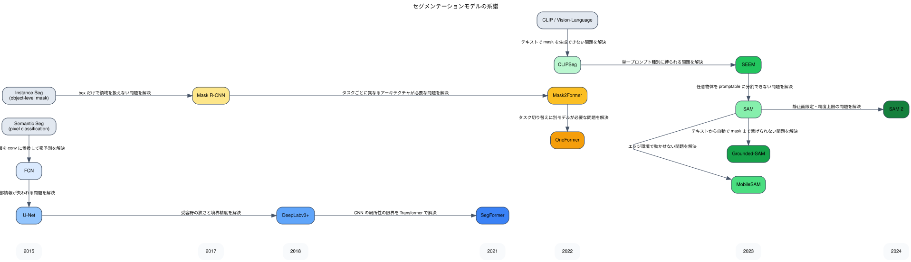

# Segmentation Knowledge

このメモは、セグメンテーションモデルがどう発展してきたかと、このリポジトリでの実験を通して何が分かったかを整理したものです。  
対象は主に `YOLO11-seg`, `SAM 2`, `Grounded-SAM` です。

## セグメンテーションの種類

セグメンテーションには以下の 3 種類があり、タスクの要件によって使い分ける。

**Semantic Segmentation（意味的分割）**
- ピクセルごとにクラスラベルを付ける
- 同じクラスの物体は個体を区別しない
- 出力: `(H, W)` の class index マップ
- 評価指標: mIoU
- 用途: 路面・空・建物の領域分類、農地判別、医療画像の臓器分割

**Instance Segmentation（インスタンス分割）**
- 同じクラスでも個体ごとに別マスクとして出力する
- 背景ピクセルはどのインスタンスにも属さない
- 出力: 個数分のバイナリマスク + クラスラベル + スコア
- 評価指標: mask AP（COCO 形式）
- 用途: 個体カウント、物体追跡、製造業の不良品検査

**Panoptic Segmentation（パノプティック分割）**
- Semantic + Instance を統合した全ピクセルカバー
- things（物体）はインスタンス単位、stuff（背景）はクラス単位
- 出力: 各ピクセルに `(class_id, instance_id)` のペア
- 評価指標: PQ（Panoptic Quality）= SQ × RQ
- 用途: 自動運転、ロボットナビゲーション

| 観点 | Semantic | Instance | Panoptic |
| --- | --- | --- | --- |
| 個体識別 | なし | あり | あり（things のみ） |
| 背景カバー | あり | なし | あり |
| 全ピクセルを分類 | ✓ | ✗ | ✓ |
| アノテーションコスト | 中 | 高 | 最高 |

実務では「個体に紐づけて判断したい」要件が多いため、Instance Segmentation の優先度が最も高い。  
Panoptic は情報量が最大だが、アノテーションコストが高く、全シーン理解が必要な特定用途（自動運転など）に限られる。

## 全体像

セグメンテーションモデルの主要な流れは、大きく 3 本。

- `Semantic 系（encoder-decoder）`
  - FCN, U-Net, DeepLabv3+, SegFormer など
  - ピクセル単位の密予測を解く
- `Instance / Unified 系`
  - Mask R-CNN, Mask2Former, OneFormer など
  - 物体単位のマスク生成と、全タスク統合に向けた発展
- `Promptable / Zero-shot 系`
  - SAM, SAM 2, CLIPSeg, SEEM, Grounded-SAM など
  - point / box / text プロンプトで汎用的に分割する

## 系譜図

## 1. Semantic 系（encoder-decoder）

### FCN

- 位置づけ:
  - 深層学習ベースのピクセル単位分類の起点
- 何をしたか:
  - 分類ネットワークの全結合層を 1x1 conv に置き換えて密予測を可能にした
- 限界:
  - 細部情報が失われやすく、境界が甘い

### U-Net

- 派生元:
  - FCN
- 何が改善されたか:
  - skip connection で encoder の細部情報を decoder に直接引き渡すようにした
- 意味:
  - 医療画像など細部が重要なタスクの基礎構造として定着

### DeepLabv3+

- 派生元:
  - U-Net 系の encoder-decoder
- 何が改善されたか:
  - atrous（dilated）conv と ASPP（Atrous Spatial Pyramid Pooling）で受容野を拡大した
  - encoder-decoder に Xception を backbone として採用した
- 意味:
  - CNN 系 semantic seg の精度上限をそれまでより大きく引き上げた

### SegFormer

- 派生元:
  - DeepLabv3+ 系 + Transformer の流れ
- 何が改善されたか:
  - Mix-FFN と階層的 Transformer encoder で局所 / 大域の両方を扱いやすくした
  - 軽量 decoder（MLP のみ）で速度と精度を両立した
- 意味:
  - CNN 系に対して Transformer が実用レベルで入れ替わり可能と示した

## 2. Instance / Unified 系

### Mask R-CNN

- 派生元:
  - Faster R-CNN
- 何が改善されたか:
  - detection head に加えて mask head（小さな FCN）を追加した
- 意味:
  - instance segmentation を実用レベルに押し上げた基礎モデル

### Mask2Former

- 派生元:
  - DETR 系 + Mask R-CNN の流れ
- 何が改善されたか:
  - masked attention で semantic / instance / panoptic の全タスクを 1 つのアーキテクチャで扱えるようにした
- 意味:
  - unified segmentation の精度最前線

### OneFormer

- 派生元:
  - Mask2Former
- 何が改善されたか:
  - タスク条件付きテキストクエリでモデルを 1 つに統合した
- 意味:
  - 1 モデルで 3 タスクを切り替えられる最も実践的な unified モデル

## 3. Promptable / Zero-shot 系

### CLIPSeg

- 派生元:
  - CLIP 系 vision-language 表現
- 何が改善されたか:
  - CLIP の特徴量を thin decoder に通してテキスト → mask を生成できるようにした
- 意味:
  - text-prompted segmentation の最初期の実装として原理理解に有用

### SEEM

- 派生元:
  - CLIPSeg + SAM の流れ
- 何が改善されたか:
  - point / text / box / 参照画像など多種プロンプトを統一して扱えるようにした
- 意味:
  - promptable segmentation の frontier 候補

### SAM（Segment Anything Model）

- 派生元:
  - CLIPSeg / SEEM 系の promptable segmentation
- 何が改善されたか:
  - 1B 枚超の大規模データで学習し、任意の物体を高精度にゼロショット分割できるようにした
- 意味:
  - promptable segmentation の実用上の起点

### MobileSAM

- 派生元:
  - SAM
- 何が改善されたか:
  - SAM の image encoder を tiny ViT に蒸留してエッジ / 低スペック環境で動くようにした
- 意味:
  - 速度優先ユースケースでの SAM 代替候補

### Grounded-SAM

- 派生元:
  - SAM + Grounding DINO
- 何が改善されたか:
  - テキストプロンプト → Grounding DINO で bbox 検出 → SAM でマスク生成、という 2 段パイプラインを構成した
- 意味:
  - テキストから mask まで完全自動で繋がる現実務本命パイプライン

### SAM 2

- 派生元:
  - SAM
- 何が改善されたか:
  - 動画への対応と静止画でも精度向上を達成した
  - streaming memory を持つことでフレーム間追跡が可能になった
- 意味:
  - 静止画でも SAM より実務本命。動画追跡も含めた最前線

## このリポジトリで分かったこと

対象:

- `YOLO11-seg`（supervised inference）
- `SAM 2`（zero-shot automatic mode）
- `Grounded-SAM`（zero-shot text-prompted）

データ:

- `COCO 2017 val` から 500 枚

評価指標:

- `YOLO11-seg` / `Grounded-SAM`: mask AP（pycocotools segm）
- `SAM 2`: best-match IoU + Recall@50（クラスラベルなしのため別指標）

### 1. Grounded-SAM が zero-shot で最も高い mask AP を出した

500 枚の結果は次のとおりだった。

- `Grounded-SAM`
  - `mask AP@0.5 = 0.646`
  - `mask AP@[0.5:0.95] = 0.448`
- `YOLO11-seg`
  - `mask AP@0.5 = 0.617`
  - `mask AP@[0.5:0.95] = 0.392`

`Grounded-SAM` が両指標で `YOLO11-seg` を上回った。

ここから読み取れること:

- `Grounded-SAM`
  - Grounding DINO の高い検出力と SAM 2 の高精度マスクを組み合わせた効果が出ている
  - テキストプロンプトで COCO 80 クラスを自動検出できるため、クラス未知状態でも動く
- `YOLO11-seg`
  - pretrained weights を直接評価した結果であり、fine-tuning なしでも実務水準の精度が出る
  - ultralytics エコシステムで実装・デプロイが最も楽

実務上の意味:

- ラベルがない段階では `Grounded-SAM` を最初に試す価値が高い
- デプロイ容易性や速度を優先するなら `YOLO11-seg`

### 2. SAM 2 の automatic mode は指標の性質が違うため直接比較できない

SAM 2 の結果:

- `recall@50 = 0.599`
- `mean best-match IoU = 0.537`

SAM 2 の automatic mode はクラスラベルなしでマスクを出力するため、mask AP は計算できない。  
代わりに「GT の物体をどれだけカバーできたか」を recall で測った。

recall@50 = 0.599 は、GT インスタンスの約 60% に対して IoU 0.5 以上のマスクが存在したことを意味する。

ここから読み取れること:

- SAM 2 は「クラスを問わず画像内の物体を見つける力」は比較的高い
- ただし 40% は見つけられておらず、小物体や密集物体で取り漏らしが起きやすい
- クラス分類は一切行わないため、その後の分類ステップが別途必要になる

実務上の意味:

- 「とにかく候補領域を洗い出してから分類する」というパイプラインでの活用が向いている
- annotation 補助（クリック → マスク自動生成）での使い方が現状最も実務に合っている

### 3. mask AP@0.5 と mask AP@[0.5:0.95] の差は物体検出と同様に大きい

- `Grounded-SAM`: `AP@0.5 = 0.646` に対して `AP = 0.448`
- `YOLO11-seg`: `AP@0.5 = 0.617` に対して `AP = 0.392`

どちらも AP@0.5 から AP@[0.5:0.95] への落差が大きい。

物体検出と同じく、マスクでも「だいたい当たっている」と「ピクセル単位できちんと合っている」は別物である。  
境界の甘さ、小物体でのズレが mAP を押し下げる。

実務上の意味:

- downstream で「マスクの輪郭を正確に使いたい」場合は AP@[0.5:0.95] や AP@0.75 を重視する
- 「だいたいの領域が分かればよい」ならば AP@0.5 で判断してよい

### 4. scale 別では大物体ほど全モデルで精度が高く、小物体は低い

物体検出と同じ傾向が instance segmentation でも確認された。

`mask_ap_large` は両モデルで高く、`mask_ap_small` は大きく落ちる。  
マスクの場合、小物体は bbox に加えて境界ピクセルの精度も要求されるため、物体検出より小物体の難しさはさらに高い。

実務上の意味:

- 小物体が重要な案件では、入力解像度の引き上げや patch-based 推論が必要になる

### 5. YOLO11-seg は pretrained inference で十分実務水準を出す

今回の `YOLO11-seg` は fine-tuning なしの pretrained weights での推論のみだった。  
それでも `mask AP@0.5 = 0.617` を達成しており、実務初期段階では十分な水準。

物体検出の `YOLO11` と同様に、ultralytics エコシステムの恩恵として:

- 実装が最もシンプル
- export / deployment が最もやりやすい
- instance segmentation + 物体検出を同一モデルで扱える

実務上の意味:

- 学習データがあれば fine-tuning → さらに精度向上が見込める
- まず pretrained で動かしてから必要に応じて学習へ進む、という段取りが有効

## 実務上の選び方

### zero-shot でまず試す

- `Grounded-SAM`

向いている状況:

- ラベルがない
- テキストで対象を指定して即マスクを出したい
- PoC を素早く回したい

### 候補領域の洗い出し / annotation 補助

- `SAM 2`

向いている状況:

- 分類は別で行い、とにかくマスク候補を大量に出したい
- アノテーターがクリックするだけでマスクを自動生成したい
- 動画トラッキングまで含めたパイプラインを考えている

### 実装・デプロイ優先 / fine-tuning を視野に

- `YOLO11-seg`

向いている状況:

- ultralytics エコシステムで扱いたい
- ラベルデータを用意して fine-tuning まで行う予定がある
- 物体検出と instance segmentation を 1 モデルで扱いたい

### 精度最前線の supervised モデルが必要

- `Mask2Former` / `OneFormer`

向いている状況:

- semantic / instance / panoptic を高精度で扱いたい
- ADE20K や COCO panoptic の標準ベンチマークで評価が必要

## 次にやるとよいこと

- `Grounded-SAM`
  - text prompt の改善（クラス名だけでなく属性を加える）
  - box threshold / text threshold の最適化
  - Grounding DINO-base → large への切り替えで精度向上を確認
- `SAM 2`
  - points_per_side の増加で recall 向上を確認
  - box-prompted mode（GT bbox または detector 出力を入力）での上限精度を測る
- `YOLO11-seg`
  - 本番学習条件（yolo11m-seg / epoch 拡張）での精度向上を確認
  - small object 向けの入力解像度引き上げ
- `Mask2Former` / `OneFormer`
  - ADE20K での semantic segmentation 評価
  - COCO panoptic での panoptic segmentation 評価
