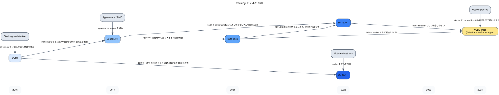

# Tracking Knowledge

このメモは、tracking モデルがどう発展してきたかと、このリポジトリでの実験を通して何が分かったかを整理したものです。  
対象は主に `ByteTrack`, `BoT-SORT`, `DeepSORT`, `OC-SORT` と、前段 detector として使う `YOLO11n` です。

## 全体像

tracking の主要な流れは、大きく次の 3 本で整理しやすいです。

- `tracking-by-detection 系`
  - SORT, DeepSORT, ByteTrack, BoT-SORT, OC-SORT など
  - 各フレームで detector が bbox を出し、その後 tracker が時系列で結びつける
- `appearance / ReID 強化系`
  - DeepSORT, BoT-SORT など
  - 動きだけでなく見た目特徴も使い、再登場や交差に強くしようとする
- `動画理解・end-to-end 系`
  - joint detection-tracking や transformer 系 MOT
  - detector と tracker を一体に近い形で扱う

今回の repo 実験は、このうち `tracking-by-detection` を対象にしている。

## 系譜図

Graphviz 版の図です。横軸は発表年のおおまかな時系列で、edge には「どの課題を解決したか」を短く書いています。

## 1. Tracking-by-detection の基礎

### SORT

- 位置づけ:
  - tracking-by-detection の基礎
- 何をしたか:
  - Kalman Filter と Hungarian matching で、bbox をフレーム間で結びつけた
- 意味:
  - detector と tracker を分けて考える標準的な流れを定着させた
- 限界:
  - 見た目情報を使わないので、遮蔽や交差で ID が崩れやすい

### DeepSORT

- 派生元:
  - SORT
- 何が改善されたか:
  - motion だけでなく ReID 特徴を追加し、似た位置の別人物を区別しやすくした
- 意味:
  - appearance feature を tracking に入れる代表例になった
- 実務での意味:
  - 人が交差したり、一時的に消えて再登場する場面で有効なことが多い

## 2. Modern MOT 系

### ByteTrack

- 派生元:
  - tracking-by-detection 系全般
- 何が改善されたか:
  - 低スコア detection を単純に捨てず、後段 matching にも使うことで見逃しを減らした
- 意味:
  - 「tracker より前に detector の score cut がきつすぎる」問題を改善した
- 実務での意味:
  - 実装が比較的軽く、それでいて強い基準線として扱いやすい

### BoT-SORT

- 派生元:
  - ByteTrack, DeepSORT 系
- 何が改善されたか:
  - ReID と camera motion compensation を組み合わせ、ID switch を減らそうとした
- 意味:
  - crowded scene や moving camera での改善を狙う modern tracker
- 実務での意味:
  - ReID を使いたい tracking パイプラインの有力候補

### OC-SORT

- 派生元:
  - SORT 系
- 何が改善されたか:
  - 単純な観測ベースの関連付けを改善し、motion ベースで頑健にしようとした
- 意味:
  - ReID を強く使わずに tracking を改善する方向の代表例

## 3. 前段 detector の重要性

tracking-by-detection では、tracker 単体では完結しない。  
前段 detector の品質が、そのまま tracking 品質に効く。

今回の repo では以下で固定している。

- detector: `YOLO11n` pretrained
- tracker: `ByteTrack`, `BoT-SORT`
- dataset: `DanceTrack val`
- class: `person`

この構成の意味:

- tracker の差を見やすくする
- detector の比較に実験軸を広げすぎない
- 学習なしでどこまでいけるかをまず確認する

## ReID について

`ReID` は `re-identification` の略で、一度見失った対象が再び現れたときに、同じ人物だと判定するための仕組みである。

たとえば:

- 人が他人の後ろに隠れる
- 画面外に出て再登場する
- 複数人が交差する

といった場面では、位置だけでは同一人物と判断しにくい。  
そこで見た目特徴をベクトル化して、「前にいた人物と似ているか」を使うのが ReID である。

実務上の意味:

- 短い遮蔽なら ReID なしでも何とかなることがある
- 長い遮蔽や再登場では ReID が効きやすい
- ただし服装が似ている、解像度が低い、密集していると ReID も難しい

`ReID 学習` は、この appearance feature を出すモデルを学習することを指す。  
通常は ID 付きアノテーションが必要であり、完全アノテーションなしで安定して使うのは難しい。

## 評価指標

tracking では、bbox の当たり外れだけでなく、「同じ対象を同じ ID で追い続けられたか」を見ないといけない。  
そのため、物体検出より評価指標が複雑になる。

今回の repo では主に以下を見る。

### HOTA

- 何を見るか:
  - detection quality と association quality の両方をまとめて見る
- 読み方:
  - 高いほど、見つけ方とつなぎ方の両方が良い
- 実務での意味:
  - tracking の総合力を見るときの第一候補

### IDF1

- 何を見るか:
  - 同一人物を同じ ID で追えているか
- 読み方:
  - 高いほど ID の一貫性が高い
- 実務での意味:
  - 見失い後の再接続や ID switch の少なさを重視するときに重要

### MOTA

- 何を見るか:
  - false positive, false negative, ID switch をまとめた古典的指標
- 読み方:
  - 高いほどよいが、detection 品質の影響を強く受ける
- 実務での意味:
  - tracker 単体というより detector + tracker の全体性能を見るときに使う

### IDs

- 何を見るか:
  - ID switch の回数
- 読み方:
  - 少ないほどよい
- 実務での意味:
  - 人物交差や再登場での追跡の崩れを直接見たいときに分かりやすい

### FP / FN

- `FP`:
  - 検出してはいけないものを検出した回数
- `FN`:
  - GT があるのに見逃した回数
- 実務での意味:
  - tracking の悪さが detector 由来なのか、association 由来なのかを切り分けるヒントになる

## このリポジトリで分かったこと

対象:

- `YOLO11n + ByteTrack`
- `YOLO11n + BoT-SORT`
- `DanceTrack val`

### 1. 今回の tracking は「tracker 比較」であって、学習実験ではない

今回の方針は学習なしでどこまで tracking できるかを見ることであり、`ByteTrack` や `BoT-SORT` 自体は学習していない。  
必要なら detector を学習する余地はあるが、tracker 側はまず既存手法を使うのが自然である。

実務上の意味:

- まず pretrained detector + 既存 tracker で確認する
- 足りなければ detector 改善、threshold 調整、ReID を検討する

### 2. DanceTrack では、tracking より前に detection が難しい場面が多い

動画を見た限り、次の条件でまず detector が崩れやすい。

- 人の見た目がかなり似ている
- 10 人以上が密集している
- 小さく重なっている
- 交差が多い

このとき起きること:

- bbox が分離しない
- 一人を二人に割る / 二人を一人にまとめる
- 小さい人物を見逃す

tracker はその検出結果をつなぐだけなので、前段 detection が崩れると tracking も崩れやすい。

実務上の意味:

- DanceTrack のような crowded human MOT では、tracker だけを見ても不十分
- stronger detector や higher-resolution 推論の必要性が見えやすい

### 3. 似た見た目・密集・交差では ReID の必要性が見えやすい

DanceTrack では人物の見た目が似ているので、交差や再登場で ID が入れ替わりやすい。  
`BoT-SORT` のような ReID 寄りの発想が必要になる理由は、こうしたシーンで明確になる。

ただし今回の実装は `ultralytics` の built-in `botsort.yaml` を使っており、独立した ReID 学習まで踏み込んではいない。

実務上の意味:

- ReID が必要になる条件を知っておく価値は高い
- ただし最初から ReID 学習まで進めるのは重い

### 4. 動画可視化だけでは tracking の良し悪しを人が全部判定するのは難しい

tracking の動画は失敗例の雰囲気をつかむのには強いが、人数が多いと

- どの ID が入れ替わったか
- 一瞬だけ崩れたのか
- 継続的に見失っているのか

を目視で全部追うのは難しい。

実務上の意味:

- 動画は失敗パターン理解に使う
- 総合判断は `HOTA`, `IDF1`, `MOTA`, `IDs`, `FP`, `FN` で行う
- notebook では代表 sequence を少数に絞るのが現実的

### 5. tracking をきちんと評価するには ID 付きアノテーションが必要

tracking の評価は、各フレームで bbox があるだけでは足りない。  
同一人物がフレームをまたいで同じ ID で結び付いている必要がある。

必要なもの:

- 各フレームの bbox
- クラス
- フレームをまたいで一貫した object ID

実務上の意味:

- benchmark を使う価値が高い
- 自社動画で本評価したいなら、少量でも ID 付き評価データを作る必要がある
- tracking は検出よりアノテーションコストが高い

## 今の整理

- `ByteTrack`
  - 学習なし tracking の主線として非常に扱いやすい
- `BoT-SORT`
  - ReID / camera motion を意識した比較対象として有力
- `YOLO11n`
  - 前段 detector としては軽量で扱いやすいが、DanceTrack の crowded scene では弱さも見えやすい
- `ReID 学習`
  - 将来的には必要になりうるが、最初から入れると重い

要するに tracking では:

- `まず動かす`: `YOLO11n + ByteTrack`
- `比較する`: `YOLO11n + BoT-SORT`
- `さらに詰める`: stronger detector, ReID, sequence-specific analysis

の順で考えると整理しやすい。
